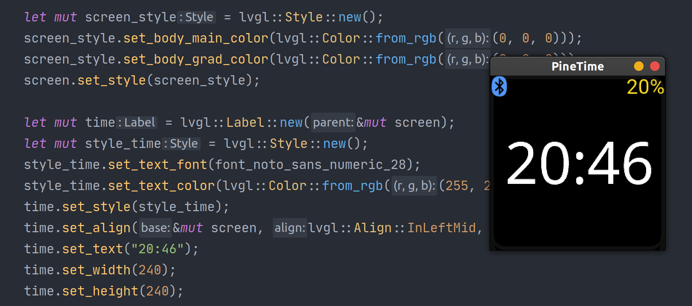

<h1 align="center"> LittlevGL - Open-source Embedded GUI Library in Rust</h1>


<p align="center">
LittlevGL provides everything you need to create a Graphical User Interface (GUI) on embedded systems with easy-to-use graphical elements, beautiful visual effects and low memory footprint. 
</p>
<p align="center">
LittlevGL is compatible with <samp>#![no_std]</samp> environments by default.
</p>

<h4 align="center">
<a href="https://lvgl.io/">Official LittlevGL Website </a> &middot; 
<a href="https://github.com/littlevgl/lvgl">C library repository</a> &middot;
<a href="https://lvgl.io/demos">Live demo</a>
</h4>

---



## Usage

Edit your `Cargo.toml` file dependencies with:
```
$ cargo add lvgl
```

The build requires the environment variable bellow to be set:

- `DEP_LV_CONFIG_PATH`: Path to the directory containing the `lv_conf.h` header file used for configuration of LittlevGL library.

We recommend the `lv_conf.h` file to be in your project's root directory. If so, the command to build your project would be:
```shell script
$ DEP_LV_CONFIG_PATH=`pwd` cargo build
```

### Building for embedded environments

We make use of `bindgen` for generating the bindings to LittlevGL at build time. There is a problem in cargo when building
for `no_std`, so we need to use a workaround to build "lvgl-rs". The mainstrem issue in cargo is being tracked at
[rust-lang/cargo#7915](https://github.com/rust-lang/cargo/issues/7915).

```shell
$ DEP_LV_CONFIG_PATH=`pwd` cargo build -Zfeatures=build_dep
```

#### Requirements / Limitations

LittlevGL C libary do allocate memory dynamically and we need to allocate memory on the heap in the Rust side as well
([`Box`](https://doc.rust-lang.org/beta/alloc/boxed/struct.Box.html)).
That is required, so we can safely provide Rust pointers through FFI. For that reason, we do require
[`alloc`](https://doc.rust-lang.org/alloc/) module to be available.

## Running the demo

[This project contains an example that can run in a desktop simulator.](./examples/demo)
